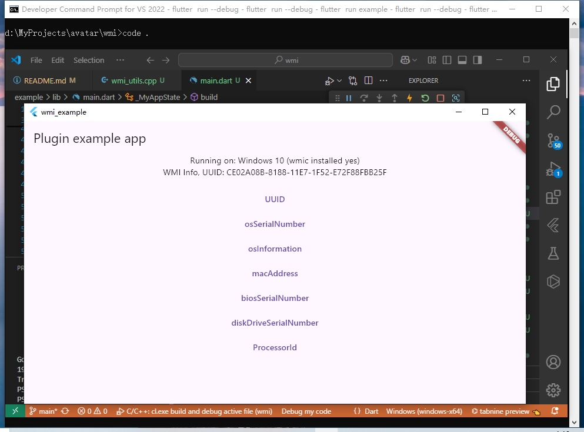

## wmi
A Flutter package for accessing Windows WMI (Windows Management Instrumentation).

### Getting Started 
```powershell
# wmic os get serialNumber,Name
Get-WmiObject -Class Win32_OperatingSystem | Select-Object -Property SerialNumber,Name
Get-WmiObject -Query "SELECT SerialNumber, Name FROM Win32_OperatingSystem"
```
> SerialNumber: 00300-00700-38916-AAOEM  
Name: Microsoft Windows 10 Home 

All three methods use WMIC to retrieve the Windows serial number and name. However, [WMIC is no longer pre-installed starting with Windows 11 version 24H2](https://learn.microsoft.com/en-us/windows-hardware/manufacture/desktop/features-on-demand-non-language-fod?view=windows-11).

 Here's how to use WMI in Flutter apps.

```powershell
flutter pub add wmi
```

### Usage

```dart
import 'package:wmi/wmi.dart';

class _MyAppState extends State<MyApp> {
    // Wmi plugin instance
  final _wmiPlugin = Wmi(); 
  bool _wmiInitialized = false;

  @override
  void initState() {
    super.initState();
    initPlatformState();    
  }

  @override
  void dispose() {
    // release resources
    if (_wmiInitialized) _wmiPlugin.wmiRelease(); 
    super.dispose();
  }

  Future<void> initPlatformState() async {
    bool wmiInitialized = false;
    try {
    // initialize resources
      wmiInitialized = await _wmiPlugin.wmiInit() ?? false;
    } on PlatformException catch (e) {
      debugPrint('Failed wmiInit(), error: $e');
    }

    if (!mounted) return;
    setState(() {
      _wmiInitialized = wmiInitialized;
    });        
  }    

```



### Example 1, get single property, using wmiValue()
```dart
String wmiinfo = "", wminame = 'UUID';
if (_wmiInitialized) {
    try {
    wmiinfo = await _wmiPlugin.wmiValue(
        fieldname: wminame,
        tablename: 'Win32_ComputerSystemProduct',
        ) ?? 'Unknown';
    } on PlatformException catch (e) {
    wmiinfo = 'Failed to get $wminame, error: $e';
    }
}
```

### Example 2, get single property, using quickshort function
```dart
String wmiinfo, wminame = 'UUID';
if (_wmiInitialized) {
    try {
        wmiinfo = await _wmiPlugin.uuid() ?? 'Unknown';
    } on PlatformException catch (e) {
        wmiinfo = 'Failed get $wminame, \n error: $e';
    } 
}
```
### Example 3, get multiple properties, using wmiValues()
```dart
String wmiinfo = "", wminame = 'RegisteredUser,SerialNumber,Name';
if (_wmiInitialized) {
    try {
    wmiinfo = await _wmiPlugin.wmiValues(
        fieldname: wminame,
        tablename: 'Win32_ComputerSystemProduct',
        ) ?? 'Unknown';
    } on PlatformException catch (e) {
    wmiinfo = 'Failed to get $wminame, error: $e';
    }
}
```

## Developer Notes
Search the taskbar for **Developer Command Prompt for VS 2022** to open a developer environment terminal.

```terminal
cd path\to\flutter\project
flutter clean
flutter pub get --no-example
# To run the example app
cd example
flutter clean
flutter pub get --no-example
flutter run --debug
```